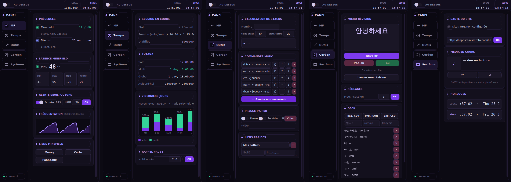

# MF Cockpit

Panneau vertical demi-écran (à poser à côté de Discord) pour suivre **Minefield** :
présences en jeu & Discord, latence serveur, temps de jeu solo/multi, plus une
boîte à outils (stacks, commandes modo, presse-papier, liens), de la révision de
coréen et quelques infos système (santé du site, média Windows, horloge Séoul).



C'est l'évolution fenêtrée de `mf_tracker.py` (le script CLI d'origine, conservé
à la racine pour référence) : toute sa logique — détection du process, mode
solo/multi, persistance du temps, `server_status`, `discord_widget` — est
reprise et refactorée dans le paquet `mfcockpit/`.

## Architecture

- **`mfcockpit/backend/`** — toute la logique réseau/IO/persistance, sans UI.
  Un **seul thread de fond** (`poller.py`) fait *tout* le périodique (ping +
  latence, widget Discord, santé site, présences, média SMTC) toutes les
  `poll_seconds` (défaut 20 s), avec des timeouts courts. Il publie un
  *snapshot* thread-safe ; l'UI ne fait **jamais** de réseau, elle lit juste le
  snapshot via une boucle `after()`. CPU ~0 entre deux ticks, erreurs réseau
  silencieuses.
- **`mfcockpit/ui/`** — fenêtre customtkinter (sombre, look « cockpit » violet),
  redimensionnable, « toujours au-dessus » optionnel. Navigation par **sidebar**
  verticale (icônes + état actif) vers les vues **MF · Alertes · Temps · Outils ·
  Coréen · Système**, titlebar avec horloges locale/Séoul, cartes à en-têtes losange,
  voyants à halo et graphes maison. Le thème global est piloté par
  `ui/theme_purple.json` (rechargé au démarrage) ; les polices visent
  Rajdhani / JetBrains Mono / Outfit et **retombent proprement** sur les polices
  système si elles ne sont pas installées (aucun fichier à embarquer).
  Pour respecter la perf, **seul l'onglet visible est rafraîchi** à chaque tick.

## Installation & lancement

```bash
pip install psutil mcstatus customtkinter pyperclip winotify winsdk pyinstaller
python mf_cockpit.py
```

`winotify` et `winsdk` sont **Windows uniquement** (notifications natives et
contrôle média SMTC) ; sur les autres OS l'app se lance quand même et dégrade
proprement (bannière + bip à la place des notifs, média masqué).

Tout est aussi listé dans `requirements.txt` :

```bash
pip install -r requirements.txt
```

## Build .exe (Windows)

Mono-fichier, fenêtré :

```bash
pyinstaller MF_Cockpit.spec
# -> dist/MF_Cockpit.exe
```

Équivalent en ligne (le `.spec` est préférable car il règle les hidden-imports
de `mcstatus`, `dns.*`, `winotify`, `winsdk/winrt`) :

```bash
pyinstaller --onefile --windowed --name MF_Cockpit \
  --hidden-import mcstatus --collect-submodules dns \
  --collect-submodules winsdk --hidden-import winotify \
  mf_cockpit.py
```

## Configuration

Au premier lancement, un **`config.json`** est créé **à côté de l'exe** (ou à la
racine du projet en dev). Il est rechargé au démarrage et **réécrit dès que tu
modifies un réglage ou une liste dans l'UI** — rien à recompiler.

Réglages couverts : host/port serveur, `discord_guild_id`, `poll_seconds`,
seuils de latence, seuils d'alerte joueurs (+ on/off), flux quêtes/wanted du
site (`quests_feed` : url, cadence, notifs on/off), durée du rappel pause,
taille de stack & slots/coffre, N du presse-papier (+ persist on/off), URL de
santé du site, liens rapides, liens MF, commandes modo, deck coréen &
mots/session, géométrie de fenêtre & « toujours au-dessus ».

Fichiers runtime générés à côté (ignorés par git) : `playtime.json` (temps par
jour), `attendance.log` (fréquentation roulante ~48 h), `clipboard.json` (si
persistance activée).

### Activer le widget Discord

Dans Discord : **Paramètres du serveur → Widget → Activer le widget**, puis copie
l'**ID du serveur** dans `config.json` (`discord_guild_id`). Seul le widget
**public** est lu (pas de self-bot — c'est contre les CGU et expose au ban). Si
le widget est désactivé, l'onglet MF l'indique et continue sans planter.

## Onglets

- **[MF]** — présences Minefield (X/Y + pseudos si exposés) et Discord (en ligne
  + vocal) ; latence en continu (ms actuel + min/moy/max glissants, voyant
  couleur, % de perte) ; alerte au franchissement d'un seuil haut/bas (notif
  anti-spam) ; sparkline de fréquentation ; liens money/carto/panneaux.
- **[Alertes]** — flux « cockpit » du site (`/api/quests/cockpit/<token>.json`,
  URL secrète à copier depuis le bouton « 🛰️ Cockpit MF » de `/quetes`) : quêtes
  récurrentes non faites cette période (avec compte à rebours de reset) et
  quêtes à échéance sous 72 h — chacune avec ses **items requis** (📦), ses
  **récompenses** (🎁) et ses **coordonnées** (📍, un clic copie `x y z` à
  coller en jeu) — plus la liste d'items perso « wanted » (priorité, projet,
  note, coordonnées). Poll toutes les 5 min (`quests_feed.poll_seconds`),
  notification Windows groupée à chaque *nouveauté* (quête redevenue dispo
  après un reset, nouvelle échéance, nouvel item) — jamais au premier
  relevé, désactivable (`quests_feed.notify`). Marche avec le feed actuel du
  site (les champs absents sont juste omis) ; pour le feed enrichi + la page
  admin qui pilote ce qui est envoyé, donner `docs/prompt-site-cockpit.md`
  à Claude sur le repo du site.
- **[Temps]** — session en cours (solo/multi), totaux, total du jour, moyenne/jour
  et ratio solo/multi sur 7 jours + graphe barres ; rappel pause configurable.
- **[Outils]** — calculateur de stacks ; commandes modo éditables (copier /
  ajouter / réordonner / supprimer) ; gestionnaire d'historique du presse-papier
  (pause, persist, vider) ; liens rapides éditables.
- **[Coréen]** — micro-révision (SM-2 allégé) proposée à chaque lancement ; deck
  éditable + import/export CSV/JSON ; ~10 mots de départ.
- **[Système]** — santé de `baptiste-niszczota.com` (voyant + temps de réponse) ;
  média Windows (SMTC : titre/artiste/pochette + ⏮ ⏯ ⏭) ; horloges locale & Séoul.

## Notes

- Aucune dépendance à matplotlib : les graphes (sparkline, barres) sont tracés
  à la main sur des `Canvas`.
- L'API média SMTC est asynchrone : elle tourne dans le thread de fond, jamais
  dans l'UI.
