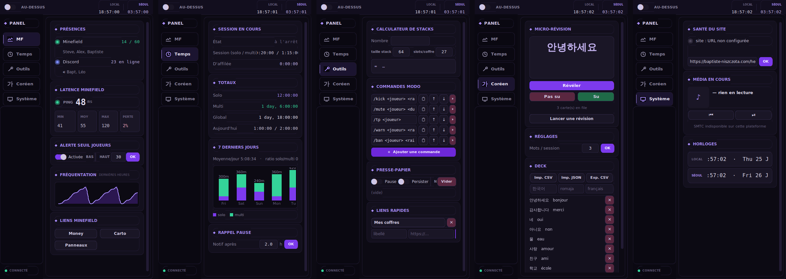

# MF Cockpit

Panneau vertical demi-écran (à poser à côté de Discord) qui sert de **tableau de
bord quotidien** : le sport et le coréen du jour à cocher, plus le suivi de
**Minefield** (présences en jeu & Discord, latence serveur, temps de jeu
solo/multi), une boîte à outils (stacks, commandes modo, presse-papier, liens)
et quelques infos système (santé du site, média Windows, horloge Séoul).

Il embarque aussi un **serveur local** qui sert une page mobile : on déroule sa
séance depuis l'iPhone à la salle, chronos compris, **hors ligne**, et tout
remonte en base au retour sur le wifi.



C'est l'évolution fenêtrée de `mf_tracker.py` (le script CLI d'origine, conservé
à la racine pour référence) : toute sa logique — détection du process, mode
solo/multi, persistance du temps, `server_status`, `discord_widget` — est
reprise et refactorée dans le paquet `mfcockpit/`.

## Architecture

- **`mfcockpit/backend/`** — toute la logique réseau/IO/persistance, sans UI.
  Un **seul thread de fond** (`poller.py`) fait *tout* le périodique (ping +
  latence, widget Discord, santé site, présences, média SMTC) toutes les
  `poll_seconds` (défaut 20 s), avec des timeouts courts. Il publie un
  *snapshot* thread-safe ; l'UI ne fait **jamais** de réseau, elle lit juste le
  snapshot via une boucle `after()`. CPU ~0 entre deux ticks, erreurs réseau
  silencieuses.
- **`mfcockpit/ui/`** — fenêtre customtkinter (sombre, look « cockpit » violet),
  redimensionnable, « toujours au-dessus » optionnel. Navigation par **sidebar**
  verticale (icônes + état actif) vers les vues **Aujourd'hui · Perso · MF ·
  Alertes · Temps · Stats · Outils · Coréen · Système**, titlebar avec horloges
  locale/Séoul, cartes à en-têtes losange,
  voyants à halo et graphes maison. Le thème global est piloté par
  `ui/theme_purple.json` (rechargé au démarrage) ; les polices visent
  Rajdhani / JetBrains Mono / Outfit et **retombent proprement** sur les polices
  système si elles ne sont pas installées (aucun fichier à embarquer).
  Pour respecter la perf, **seul l'onglet visible est rafraîchi** à chaque tick.
- **`cockpit.db`** — une base **SQLite** posée à côté de l'exe (WAL, migrations
  versionnées et idempotentes) qui porte tout le domaine sport & coréen :
  référentiel d'exercices, programme, journal des séances et des séries, deck
  SRS, tâches du jour, streaks, file de synchronisation. `backend/db.py` en est
  le seul point d'entrée ; une seule connexion partagée, protégée par un verrou,
  parce que l'UI **et** le serveur mobile écrivent tous les deux.
- **`web/` + `backend/webserver.py`** — la page mobile et son serveur HTTP local
  (un `ThreadingHTTPServer` dans un thread daemon : le **seul** thread ajouté).
  Rien de ce qui s'y passe ne peut faire tomber le cockpit — port pris, pare-feu
  ou dossier absent, l'app tourne et la carte affiche « serveur hors ligne ».

Le domaine sport/coréen est **entièrement local** : aucun réseau à interroger,
donc aucun nouveau poller. Les rappels sont branchés sur le tick existant.

## Installation & lancement

```bash
pip install psutil mcstatus customtkinter pyperclip winotify winsdk pyinstaller
python mf_cockpit.py
```

`winotify` et `winsdk` sont **Windows uniquement** (notifications natives et
contrôle média SMTC) ; sur les autres OS l'app se lance quand même et dégrade
proprement (bannière + bip à la place des notifs, média masqué).

Tout est aussi listé dans `requirements.txt` :

```bash
pip install -r requirements.txt
```

## Build .exe (Windows)

Mono-fichier, fenêtré :

```bash
pyinstaller MF_Cockpit.spec
# -> dist/MF_Cockpit.exe
```

Équivalent en ligne (le `.spec` est préférable car il règle les hidden-imports
de `mcstatus`, `dns.*`, `winotify`, `winsdk/winrt`) :

```bash
pyinstaller --onefile --windowed --name MF_Cockpit \
  --hidden-import mcstatus --collect-submodules dns \
  --collect-submodules winsdk --hidden-import winotify \
  mf_cockpit.py
```

## Configuration

Au premier lancement, un **`config.json`** est créé **à côté de l'exe** (ou à la
racine du projet en dev). Il est rechargé au démarrage et **réécrit dès que tu
modifies un réglage ou une liste dans l'UI** — rien à recompiler.

Réglages couverts : host/port serveur, `discord_guild_id`, `poll_seconds`,
seuils de latence, seuils d'alerte joueurs (+ on/off), flux quêtes/wanted du
site (`quests_feed` : url, cadence, notifs on/off), durée du rappel pause,
taille de stack & slots/coffre, N du presse-papier (+ persist on/off), URL de
santé du site, liens rapides, liens MF, commandes modo, deck coréen &
mots/session, géométrie de fenêtre & « toujours au-dessus ».

Fichiers runtime générés à côté (ignorés par git) : `cockpit.db` (**toute la
base sport & coréen**, voir *Sauvegarde* plus bas), `playtime.json` (temps par
jour), `attendance.log` (fréquentation roulante ~48 h), `clipboard.json` (si
persistance activée).

Les réglages du domaine sport/coréen (onglet de démarrage, port et jeton
mobile, horaires de rappel…) vivent dans la table `reglage` de `cockpit.db`, pas
dans `config.json` — ils sont tous éditables depuis l'onglet Système.

### Activer le widget Discord

Dans Discord : **Paramètres du serveur → Widget → Activer le widget**, puis copie
l'**ID du serveur** dans `config.json` (`discord_guild_id`). Seul le widget
**public** est lu (pas de self-bot — c'est contre les CGU et expose au ban). Si
le widget est désactivé, l'onglet MF l'indique et continue sans planter.

## Onglets

- **[Aujourd'hui]** — *l'onglet ouvert au lancement* (réglage
  `ui.onglet_demarrage`). Date, **deux streaks séparés** (sport et coréen, qui
  ne dépendent l'un de l'autre en rien), séance du jour avec charge proposée par
  exercice et case à cocher, bloc d'abdos du soir (rotation A/B/C), coréen de la
  semaine + checklist, cardio les jours prévus, foot en salle, bande des 7 jours
  (une pastille par domaine, clic pour le détail) et carte **Accès téléphone**
  avec QR code.
- **[Stats]** — volume hebdomadaire global et par groupe, charge & 1RM estimé
  (Epley) par exercice, records, séances/semaine vs objectif, assiduité
  mensuelle, répartition maison/salle et PC/téléphone, contacts plyo, calendrier
  heatmap 12 mois, cardio (distance, allure, meilleur 5 km), poids et
  mensurations avec moyenne glissante 7 jours, et côté coréen : cartes
  apprises/en cours/matures, taux de réussite par jour et par direction,
  avancement des 9 semaines, bêtes noires, prévision des cartes dues.
  Et surtout la **courbe des douleurs genou/hanche superposée au volume
  jambes** — c'est le graphe qui sert le plus. Tout est calculé en SQL, et rien
  ne tourne quand l'onglet n'est pas visible.
- **[MF]** — présences Minefield (X/Y + pseudos si exposés) et Discord (en ligne
  + vocal) ; latence en continu (ms actuel + min/moy/max glissants, voyant
  couleur, % de perte) ; alerte au franchissement d'un seuil haut/bas (notif
  anti-spam) ; sparkline de fréquentation ; liens money/carto/panneaux.
- **[Alertes]** — flux « cockpit » du site (`/api/quests/cockpit/<token>.json`,
  URL secrète à copier depuis le bouton « 🛰️ Cockpit MF » de `/quetes`) : quêtes
  récurrentes non faites cette période (avec compte à rebours de reset) et
  quêtes à échéance sous 72 h — chacune avec ses **items requis** (📦), ses
  **récompenses** (🎁) et ses **coordonnées** (📍, un clic copie `x y z` à
  coller en jeu) — plus la liste d'items perso « wanted » (priorité, projet,
  note, coordonnées). Poll toutes les 5 min (`quests_feed.poll_seconds`),
  notification Windows groupée à chaque *nouveauté* (quête redevenue dispo
  après un reset, nouvelle échéance, nouvel item) — jamais au premier
  relevé, désactivable (`quests_feed.notify`). Marche avec le feed actuel du
  site (les champs absents sont juste omis) ; pour le feed enrichi + la page
  admin qui pilote ce qui est envoyé, donner `docs/prompt-site-cockpit.md`
  à Claude sur le repo du site.
- **[Temps]** — session en cours (solo/multi), totaux, total du jour, moyenne/jour
  et ratio solo/multi sur 7 jours + graphe barres ; rappel pause configurable.
- **[Outils]** — calculateur de stacks ; commandes modo éditables (copier /
  ajouter / réordonner / supprimer) ; gestionnaire d'historique du presse-papier
  (pause, persist, vider) ; liens rapides éditables.
- **[Coréen]** — programme **9 semaines** jusqu'au départ pour Séoul (thème,
  objectifs et note culturelle par semaine), micro-révision SRS proposée à
  chaque lancement, exercice du jour généré (reconnaissance, production, texte à
  trous, jeu de rôle, écoute), dialogues à lire à voix haute, deck éditable +
  import/export CSV/JSON.
- **[Perso]** — tableau de bord configurable, avec deux modules compacts
  **Séance du jour** et **Coréen du jour** qui lisent les mêmes fonctions
  backend que l'onglet Aujourd'hui.
- **[Système]** — accès téléphone (URL, jeton, port, encart pare-feu), réglages
  des rappels, lancement au démarrage de Windows, export CSV de chaque table,
  santé de `baptiste-niszczota.com`, média Windows (SMTC), horloges.

## Sport & coréen

### Les règles, en clair

- Le **changement de jour se fait à 4 h du matin** : une séance à 1 h compte
  pour la veille.
- Les tâches du jour sont **matérialisées** en base au premier affichage. Elles
  survivent donc à une modification du programme, et le téléphone reçoit
  exactement la même liste que le PC.
- **Deux streaks indépendants**, aucun joker : une journée non validée casse la
  série, et ça se voit sur la heatmap. Une journée est validée quand *toutes*
  ses tâches obligatoires sont cochées — bloc d'abdos du soir et cardio compris les
  jours où ils sont planifiés. Les jours de repos, le sport se valide sur le
  bloc mobilité/prehab.
- Une **séance manquée reste manquée** : elle n'est pas replanifiée et ne décale
  pas la semaine.
- Les **charges proposées viennent toujours de la dernière séance réalisée**,
  jamais du modèle.
- Tout ce qui est saisi au téléphone porte `source='tel'` : les stats
  distinguent les deux.

### La semaine type

Le programme actif est **« Haut du corps & abdos »** : priorité aux bras, aux
abdos et au dos ; les jambes servent le foot et le basket (explosivité, amorti,
mollets) plutôt que la prise de masse.

Les **lieux sont imposés** : maison le lundi et le jeudi, salle le mardi et le
vendredi. Le reste est flexible.

| Jour     | Séance                         | Lieu        | Durée   |
|----------|--------------------------------|-------------|---------|
| Lundi    | Pecs, épaules & triceps        | Maison      | 45 min  |
| Mardi    | Dos & biceps                   | Salle       | 50 min  |
| Mercredi | Mobilité & prehab genou/hanche | Maison      | 15 min  |
| Jeudi    | Bras (volume) & dos            | Maison      | 45 min  |
| Vendredi | Jambes & explosivité           | Salle       | 50 min  |
| Samedi   | Course 5 km + Full abdos       | Ext./Maison | 30+30   |
| Dimanche | Mobilité & prehab genou/hanche | Maison      | 15 min  |

Le placement suit l'équipement : les deux séances qui ont réellement besoin des
machines — tirage et poulies du dos, presse à cuisses — tombent les jours de
salle. Le lundi et le jeudi ne demandent qu'une kettlebell, une chaise et une
table (le rowing australien remplace le tirage vertical).

Plus, **tous les soirs sauf samedi, 15 min d'abdos** en rotation : A gainage ·
B fléchisseurs · C obliques. Les soirs de grosse journée l'app en garde les
trois premiers exercices au lieu des cinq. Sur la semaine, hors échauffements
et jours de mobilité, ça donne à peu près **41 % du volume sur les abdos, 40 %
sur le haut du corps et 19 % sur les jambes**.

La plyométrie (détente basket, appuis foot) est **toujours en tête de séance**,
le vendredi, tant que les jambes sont fraîches — et plafonnée à 60 contacts.

Le programme précédent (« Reprise & explosivité ») n'est pas supprimé quand la
base se met à jour : il est **archivé**, pour que les séances déjà enregistrées
gardent leur modèle et restent lisibles dans les statistiques.

### Progression

Double progression en salle (+2,5 kg quand toute la fourchette haute est tenue
avec de la réserve, un cran en moins après deux séances sous le plancher), et
**échelle de variantes** à la maison où les kettlebells plafonnent à 12 kg.
Montée en charge de la plyométrie sur 9 semaines, **plafonnée à 60 contacts par
séance**. Semaine allégée automatique toutes les 6 semaines. Et une règle
douleur codée en dur : au-delà de 3/10 au genou ou à la hanche, course et
plyométrie sont remplacées par du vélo ; si la moyenne monte trois semaines de
suite, l'app renvoie vers un professionnel plutôt que vers un réglage de
programme.

### Accès depuis l'iPhone

L'onglet **Aujourd'hui** affiche un **QR code** (encodé en pur stdlib, aucune
dépendance image) et l'URL du serveur local, du type
`http://192.168.x.x:8790/?t=<jeton>`. Le jeton est exigé sur **toutes** les
routes ; il se régénère depuis Système.

Une fois la page ouverte sur l'iPhone :

1. **« Préparer la salle »** avant de partir : tout le programme, les consignes
   et les médias du jour passent en cache local (`localStorage`).
2. Wifi coupé, la séance se déroule entièrement : un exercice à la fois, saisie
   des séries (reps ±, charge ± par pas de 1 ou 2,5 kg, RPE en trois boutons),
   et valider une série **lance automatiquement le chrono de repos**.
3. Au retour sur le wifi, la file d'opérations part vers le PC et un bundle
   frais est récupéré. Chaque opération porte un `uuid` : appuyer deux fois sur
   « synchroniser » **ne duplique rien**.

Cinq écrans en bas : **Jour** (ce qu'il y a à cocher), **Séance** (un exercice à
la fois), **Sport** (les prochaines séances, les charges du moment et le bilan
de la semaine), **Chrono** et **한국어**. Le cache se remplit tout seul au
premier lancement, donc aucun écran n'est jamais vide ; « Préparer la salle »
sert à le rafraîchir et à mettre les **médias** en cache, ce qui est la partie
longue.

Quelques partis pris, dictés par Safari iOS :

- **Pas de service worker** (impossible sans HTTPS) : l'app tient hors ligne
  tant que **l'onglet reste ouvert** — un bandeau le rappelle en permanence.
- **Pas de vibration** (l'API n'existe pas sur iOS) : la fin de repos est
  signalée par un bip Web Audio et un flash vert plein écran. Le bip est
  *programmé sur l'horloge audio*, donc il sonne même écran verrouillé — à
  condition d'avoir appuyé une fois sur 🔔 en début de séance (iOS exige un
  geste pour débloquer l'audio).
- **Les chronos sont des horodatages, jamais des ticks** : iOS gèle les timers
  en arrière-plan, donc l'affichage est recalculé à chaque frame et au retour au
  premier plan. Après trois minutes d'écran verrouillé, le temps affiché est
  juste — et si le repos s'est terminé pendant le gel, l'app dit depuis combien
  de temps.
- **L'écran s'éteint tout seul** : la Screen Wake Lock API exige HTTPS. L'app
  tente le verrou natif, sinon une micro-vidéo en boucle si tu déposes un
  `media/exos/nosleep.mp4` (voir le README de ce dossier), sinon elle affiche le
  rappel : *Réglages iOS → Écran et luminosité → Verrouillage auto → Jamais*.
- Un bouton **« Copier le résumé »** met tout le détail de la séance dans le
  presse-papier — filet de sécurité si le cache saute.

### Autoriser le pare-feu Windows

Windows bloque les connexions entrantes par défaut. Si le téléphone n'ouvre pas
la page alors que le serveur est en ligne :

> Panneau de configuration → Pare-feu Windows Defender → Paramètres avancés →
> Règles de trafic entrant → Nouvelle règle → **Port** → TCP **8790** →
> Autoriser la connexion → cocher **« Privé » uniquement** (surtout pas Public)
> → nommer la règle « MF Cockpit mobile ».

Le PC et l'iPhone doivent être sur le même réseau wifi. L'encart d'aide reste
affiché dans Système tant qu'aucune connexion n'est arrivée.

### Rappels

Le compte à rebours part de **l'ouverture du cockpit** : un rappel à T+2 h, puis
toutes les 2 h, dans la plage 9 h → 22 h (tout est réglable dans Système). Deux
fils indépendants : celui du sport s'éteint dès que la journée sport est
validée, celui du coréen pareil. Les textes sont utiles, pas génériques —
*« Jeudi · Haut du corps maison — 8 exos restants, 45 min »*. Une trace en base
évite les doublons après un redémarrage du PC.

Case **« Lancer au démarrage de Windows »** dans Système (via `winreg`, aucune
dépendance), avec une option « démarrer réduit » : dans ce cas la première
notification du jour sert de réveil.

### Médias d'exercices

Convention : `media/exos/<code_exercice>.gif|png|mp4|svg`, détecté
automatiquement et servi au téléphone. Sans fichier, l'app **génère un schéma
SVG maison**. Aucun média récupéré sur le web n'est embarqué (droits) — voir
`media/exos/README.md`.

### Sauvegarde

Tout le domaine sport & coréen vit dans **`cockpit.db`**, à côté de l'exe.
C'est le seul fichier à sauvegarder (avec `config.json` pour les réglages
Minefield). Copie-le à froid, cockpit fermé, ou copie aussi `cockpit.db-wal`.
Système propose en plus un **export CSV** de chaque table.

## Tests

```bash
python -m unittest discover -s tests -v
```

Couvre les points qui cassent silencieusement : migrations rejouées deux fois,
sync idempotente (et conflit sur une même place de série, où le plus récent
gagne), moteur de progression (montée, stagnation, descente, échelle de
variantes), calcul des streaks autour du seuil de 4 h du matin, matérialisation
d'un jour sans programme actif, plafond de contacts plyo, et déblocage de la
direction FR→KR après trois réussites.

## Notes

- Aucune dépendance à matplotlib : les graphes (sparkline, barres, courbes,
  heatmap) sont tracés à la main sur des `Canvas`.
- **Zéro dépendance runtime ajoutée** pour tout le domaine sport/coréen :
  `sqlite3`, `http.server`, `socket`, `secrets`, `json`, `uuid` et `winreg` sont
  dans la stdlib. L'encodeur QR est écrit à la main pour la même raison.
- L'API média SMTC est asynchrone : elle tourne dans le thread de fond, jamais
  dans l'UI.
